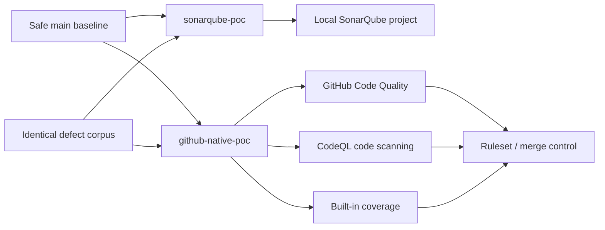

# Demonstration runbook

## Objective

Run SonarQube and the combined GitHub-native toolchain against identical source
fixtures, then compare evidence without implying one-to-one product parity.

## Comparison topology

## Evidence rules

- **Verified:** observed in this repository, an Actions run, a GitHub dashboard,
  a pull request, a SonarQube scan, or a committed API snapshot.
- **Documented:** supported by current official product documentation but not
  observed in this run.
- **Gap:** not equivalent, not supported, or not verified.

## Branch procedure

1. Establish the safe coverage baseline on `main`.
2. Create `sonarqube-poc` and `github-native-poc` from the same commit.
3. Apply the exact same defect-corpus commit to both branches.
4. Add only tool-specific configuration in later commits.
5. Verify SHA-256 hashes of all fixture files on both branches.
6. Scan `sonarqube-poc` with the local SonarQube script.
7. Open a pull request from `github-native-poc` to `main` so Code Quality,
   CodeQL, coverage, and merge controls evaluate the introduced defects.
8. Record actual counts and links in the evidence index.

## Corpus integrity

The final file list and SHA-256 values are populated after branch creation. A
hash match proves source equivalence; it does **not** imply equivalent rules,
severity, issue counts, or metrics.

## Safety

Do not run the web application. Static analysis and unit tests are sufficient.
The tests intentionally avoid every vulnerable method.