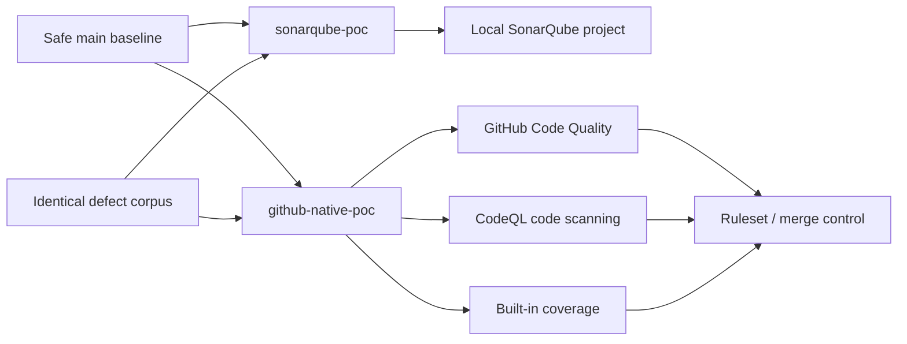

# Demonstration runbook

## Objective

Run SonarQube and the combined GitHub-native toolchain against identical source
fixtures, then compare evidence without implying one-to-one product parity.

## Comparison topology

## Evidence rules

- **Verified:** observed in this repository, an Actions run, a GitHub dashboard,
  a pull request, a SonarQube scan, or a committed API snapshot.
- **Documented:** supported by current official product documentation but not
  observed in this run.
- **Gap:** not equivalent, not supported, or not verified.

## Branch procedure

1. Establish the safe 100% coverage baseline on `main`.
2. Create `sonarqube-poc` and `github-native-poc` from the same commit.
3. Apply the exact same defect-corpus commit to both branches.
4. Add only tool-specific configuration in later commits.
5. Verify Git blob hashes of all fixture files on both branches.
6. Scan `sonarqube-poc` with the local SonarQube script.
7. Open a pull request from `github-native-poc` to `main` so Code Quality,
   CodeQL, coverage, and merge controls evaluate the introduced defects.
8. Record actual counts and links in the evidence index.

## Corpus integrity

The final Git blob IDs below match on `sonarqube-poc` and
`github-native-poc`. Git object identity proves that each listed file has the
same bytes on both branches. It does **not** imply equivalent rules, severity,
issue counts, or metrics.

| Shared file | Git blob SHA-1 on both branches |
| --- | --- |
| `src/QualityDemo.Api/QualityDemo.Api.csproj` | `c82754a50cbd18b690f0f4dcf7880aaffc1b0006` |
| `src/QualityDemo.Api/Controllers/VulnerableController.cs` | `b8843e01b8df74a15c0565c8bddf9bc4d581ff44` |
| `src/QualityDemo.Api/Services/SecurityHotspotExamples.cs` | `71edfef006f8720d4b51c5cee979d4c22ab55f7f` |
| `src/QualityDemo.Api/Services/ReliabilityExamples.cs` | `f55e1978e796998e2b60d65b09d7c359beda4766` |
| `src/QualityDemo.Api/Services/MaintainabilityExamples.cs` | `063c8a24549a433d6a366c97d1fa4e3cd0ee1089` |
| `src/QualityDemo.Api/Services/DuplicatedBusinessRules.cs` | `b9fc563673bd3e5b380346a91bb758fa22fcc480` |

Re-verify any row with `git rev-parse sonarqube-poc:<path>` and
`git rev-parse github-native-poc:<path>`.

## Demonstration walkthrough

### SonarQube

1. Check out `sonarqube-poc`.
2. Start SonarQube and follow the
  [branch runbook](https://github.com/ms-pwc/github-code-quality/blob/sonarqube-poc/docs/SONARQUBE.md).
3. Run `scripts/Initialize-SonarQube.ps1` with an administration token.
4. Run `scripts/Invoke-SonarAnalysis.ps1` with an analysis token.
5. Expect the scanner to return non-zero because the deliberate Quality Gate
  fails.
6. Inspect Overview, Issues, Measures, Quality Gates, and Security Hotspots.
7. Run `scripts/Export-SonarEvidence.ps1` to refresh sanitized JSON evidence.

### GitHub native

1. Open [pull request 1](https://github.com/ms-pwc/github-code-quality/pull/1).
2. Inspect the failing `CodeQL` security check and inline security comments.
3. Inspect inline `github-code-quality[bot]` reliability and maintainability
  comments.
4. Inspect the Code Coverage Overview comment and failing 80% CI gate.
5. Inspect the dependency-review check and active
  [ruleset](https://github.com/ms-pwc/github-code-quality/rules/20972666).
6. Confirm that the merge state is blocked.
7. Run `scripts/Export-GitHubEvidence.ps1` on `github-native-poc` to refresh
  sanitized API evidence.

## Expected interpretation

- Compare planned-scenario detection and policy outcome, not raw issue totals.
- SonarQube and GitHub use different rules, severities, taxonomies, and
  calculations.
- CodeQL covers security. GitHub Code Quality covers maintainability and
  reliability. Coverage upload and rulesets complete the GitHub-native pattern.
- GitHub does not reproduce every SonarQube metric or administration object.

## Safety

Do not run the web application. Static analysis and unit tests are sufficient.
The tests intentionally avoid every vulnerable method.